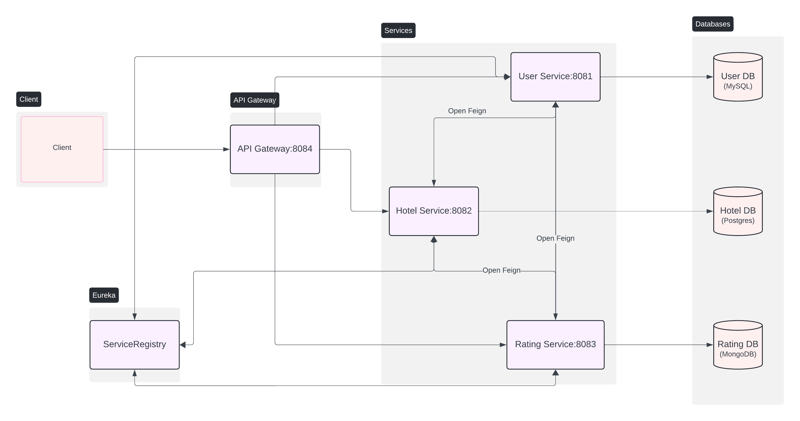
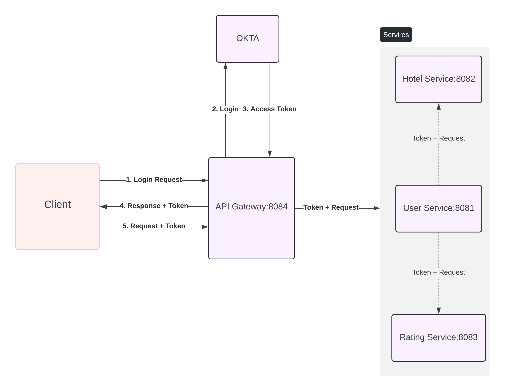

# Hotel Rating Microservice Application

This is a microservice-based application for managing hotel ratings. The application is built using Spring Boot and includes multiple services that communicate with each other using OpenFeign. The services are registered with Eureka for service discovery, and all requests are routed through an API Gateway.

## Architecture



## Services

### 1. User Service (Port: 8081)
- Manages user information.
- Connects to a MySQL database (`User DB`).
- Communicates with Hotel Service and Rating Service using OpenFeign.

### 2. Hotel Service (Port: 8082)
- Manages hotel information.
- Connects to a PostgreSQL database (`Hotel DB`).

### 3. Rating Service (Port: 8083)
- Manages hotel ratings.
- Connects to a MongoDB database (`Rating DB`).

### 4. API Gateway (Port: 8084)
- Routes client requests to the appropriate microservices.
- Acts as a reverse proxy.

### 5. Eureka Server (Port: 8761)
- Provides service discovery for all microservices.

### 6. Config Server (Port: 8085)
- Gets the common properties of servers strored in github repository.
- Gets different properties set up for developer and production environment as needed.

## Databases

- **User DB**: MySQL database for storing user information.
- **Hotel DB**: PostgreSQL database for storing hotel information.
- **Rating DB**: MongoDB database for storing hotel ratings.

## Prerequisites

- Java 17
- Maven
- Docker

## Running the Application

1. **Clone the Repository**

    ```bash
    git clone https://github.com/prabeshkunwar12/hotel_rating.git
    cd hotel_rating
    ```

2. **Build and Run the Services**

    Open a terminal for each service and run the following commands:

    ```bash
    cd user-service
    mvn clean install
    mvn spring-boot:run
    ```

    ```bash
    cd hotel-service
    mvn clean install
    mvn spring-boot:run
    ```

    ```bash
    cd rating-service
    mvn clean install
    mvn spring-boot:run
    ```

    ```bash
    cd api-gateway
    mvn clean install
    mvn spring-boot:run
    ```

    ```bash
    cd service-registry
    mvn clean install
    mvn spring-boot:run
    ```

3. **Testing the Application**

    You can use the provided Postman collection to test the application. Import the `hotel_rating.postman_collection.json` file into Postman.

## Configuration

### Application Properties

Each service has its own `application.yml` file where you can configure the database connections, Eureka server URL, and other settings.

### API Gateway Routes

The API Gateway routes are defined in the `application.yml` file of the API Gateway service.

### Configuration Repository

Configuration has its own `GitHub repository` where the properties are imported. A new repository can be created with `application.yml` files and imported by modifying `application.yml` file of the `Config Server`.

### Authentication Flow



- Login Request: The client sends a login request to the API Gateway.
- Login: The API Gateway sends the login request to OKTA.
- Access Token: OKTA provides an access token.
- Response + Token: The API Gateway sends the response with the token back to the client.
- Request + Token: The client includes the token in requests to access the services.

## Technologies Used

- Spring Boot
- Spring Cloud Netflix Eureka
- Spring Cloud OpenFeign
- Spring Cloud Config Server
- OKTA
- GitHub
- MySQL
- PostgreSQL
- MongoDB
- Docker
- JMeter
- Maven

## Contributing

Contributions are welcome! Please fork the repository and submit a pull request.

## License

This project is licensed under the MIT License. See the [LICENSE](LICENSE) file for details.
