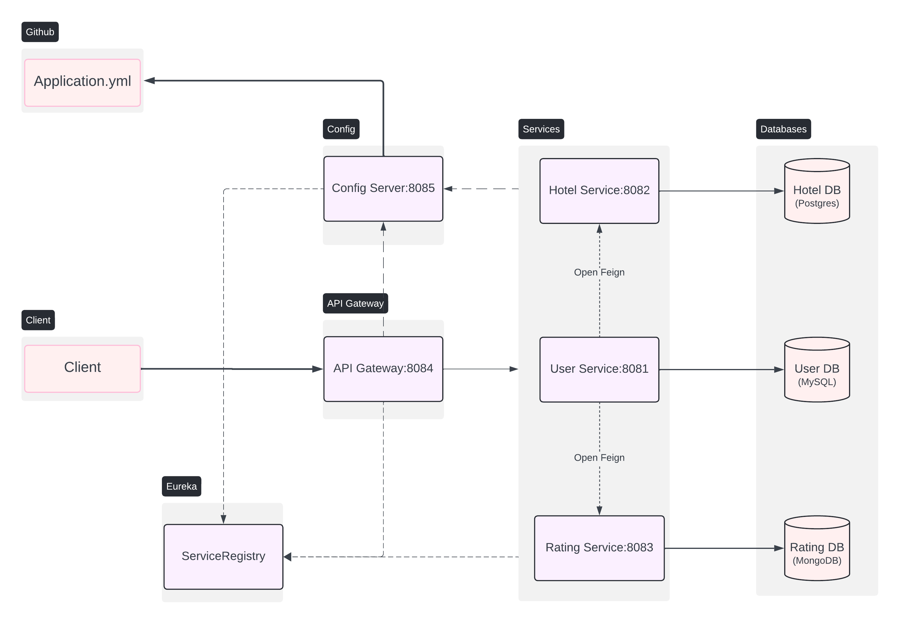

# Hotel Rating Microservice Application

This is a microservice-based application for managing hotel ratings. The application is built using Spring Boot and includes multiple services that communicate with each other using OpenFeign. The services are registered with Eureka for service discovery, and all requests are routed through an API Gateway.

## Architecture



## Services

### 1. User Service (Port: 8081)
- Manages user information.
- Connects to a MySQL database (`User DB`).

### 2. Hotel Service (Port: 8082)
- Manages hotel information.
- Connects to a PostgreSQL database (`Hotel DB`).
- Communicates with the User Service and Rating Service using OpenFeign.

### 3. Rating Service (Port: 8083)
- Manages hotel ratings.
- Connects to a MongoDB database (`Rating DB`).
- Communicates with the Hotel Service using OpenFeign.

### 4. API Gateway (Port: 8084)
- Routes client requests to the appropriate microservices.
- Acts as a reverse proxy.

### 5. Eureka Server
- Provides service discovery for all microservices.

## Databases

- **User DB**: MySQL database for storing user information.
- **Hotel DB**: PostgreSQL database for storing hotel information.
- **Rating DB**: MongoDB database for storing hotel ratings.

## Prerequisites

- Java 11 or higher
- Maven
- Docker (for running databases)

## Running the Application

1. **Clone the Repository**

    ```bash
    git clone https://github.com/prabeshkunwar12/hotel_rating.git
    cd hotel_rating
    ```

2. **Start the Databases**
   
   You can use Docker to start the required databases:

    ```bash
    docker-compose up -d
    ```

3. **Build and Run the Services**

    Open a terminal for each service and run the following commands:

    ```bash
    cd user-service
    mvn clean install
    mvn spring-boot:run
    ```

    ```bash
    cd hotel-service
    mvn clean install
    mvn spring-boot:run
    ```

    ```bash
    cd rating-service
    mvn clean install
    mvn spring-boot:run
    ```

    ```bash
    cd api-gateway
    mvn clean install
    mvn spring-boot:run
    ```

    ```bash
    cd service-registry
    mvn clean install
    mvn spring-boot:run
    ```

4. **Testing the Application**

    You can use the provided Postman collection to test the application. Import the `hotel_rating.postman_collection.json` file into Postman.

## Configuration

### Application Properties

Each service has its own `application.properties` file where you can configure the database connections, Eureka server URL, and other settings.

### API Gateway Routes

The API Gateway routes are defined in the `application.properties` file of the API Gateway service.

## Technologies Used

- Spring Boot
- Spring Cloud Netflix Eureka
- Spring Cloud OpenFeign
- MySQL
- PostgreSQL
- MongoDB
- Docker
- Maven

## Contributing

Contributions are welcome! Please fork the repository and submit a pull request.

## License

This project is licensed under the MIT License. See the [LICENSE](LICENSE) file for details.
